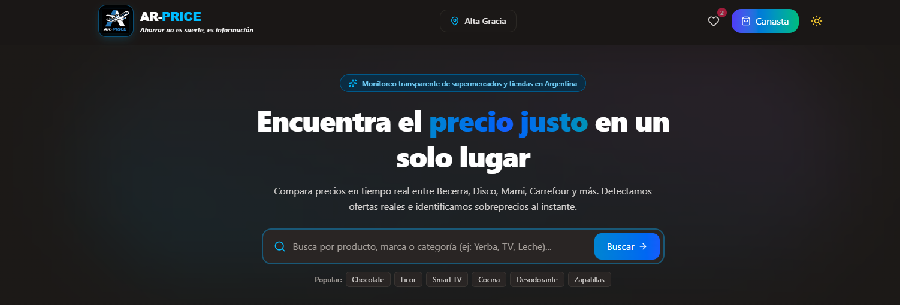
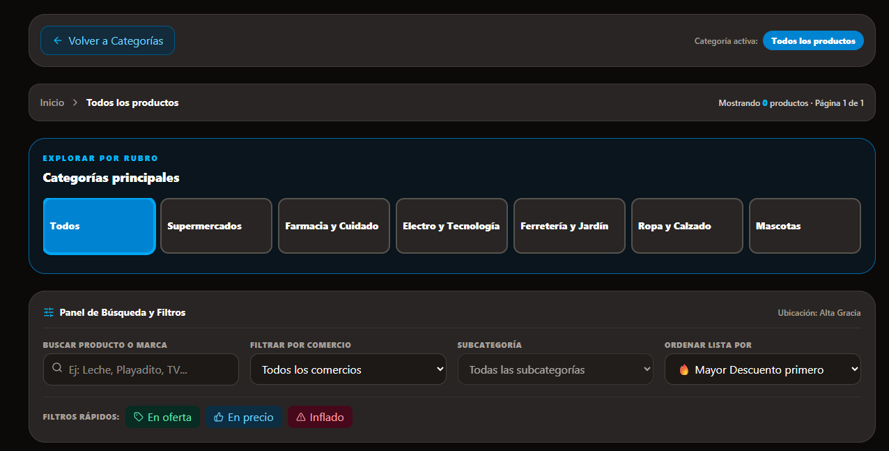

# 🛒 Ar-Price 
Plataforma Integral para la Comparación de Precios y Ahorro en Comercios Locales
**Tecnología que crece con vos.**

---

## Descripción del Proyecto
**Ar-Price** es una aplicación multiplataforma (Web y Mobile) diseñada para optimizar la economía del hogar mediante la comparación de precios entre supermercados y comercios locales.

El sistema surge como respuesta a la falta de información centralizada y actualizada, que obliga a los consumidores a realizar comparaciones manuales en un contexto de alta inflación y variación constante de precios.

El proyecto fue desarrollado como Trabajo Final Integrador 2026, combinando:

- Ingeniería de software (Backend y Frontend)
- Diseño UX/UI accesible e intuitivo
- Gestión de bases de datos relacionales
- Análisis de datos comerciales para la toma de decisiones

Incluye:
- Buscador inteligente de productos
- Comparador de precios entre comercios
- Panel administrativo para negocios
- Sistema de alertas y favoritos
- Base para actualización automática de precios

---

## Integrantes del Equipo

| Integrante | Rol | Descripción |
|------------|-----|-------------|
| **León Aliendo** | Backend Developer & Project Lead| Responsable de la lógica del sistema, planificación general y supervisión del desarrollo.|
| **Hernán Berenguer** |  Frontend Developer & UI Designer | Encargado del diseño visual, experiencia de usuario e implementación del frontend. |
| **Matias Moreno** | Backend Developer & Data Architect | Responsable de la arquitectura de datos, desarrollo web y optimización del sistema. |

**Marca del equipo:** *Kordian*  
Inspirado en la resistencia, adaptabilidad y construcción de soluciones tecnológicas escalables.

---

## Problemática

- Información de precios dispersa entre múltiples comercios
- Alta volatilidad de precios debido a inflación y promociones
- Comparación manual lenta e ineficiente
- Falta de herramientas locales que integren distintos rubros

Además, los comercios locales tienen baja visibilidad digital y pocas herramientas para competir en igualdad de condiciones.

---

## Solución Propuesta

Ar-Price plantea un ecosistema digital integrado que conecta a los usuarios con la oferta de los comercios cercanos de manera clara y eficiente.

### Para Usuarios
- Buscador con filtros por rubro, precio y ubicación
- Visualización de productos con nombre, precio y comercio
- Comparación directa entre productos similares
- Sistema de alertas de precio y favoritos
- Interfaz simple y orientada a resultados rápidos

### Para Comercios y Administradores
- Panel de gestión para carga de productos, precios y promociones
- Administración de stock y sucursales
- Base para análisis de tendencias de mercado

---

## Proyección y Escalabilidad

- Implementación de web scraping y APIs para actualización automática
- Incorporación de cupones de descuento
- Alertas personalizadas
- Expansión a múltiples ciudades y rubros
- Integración con otras plataformas digitales

---

## Tecnologías Utilizadas

### Backend:
- Python + Django

### Base de Datos:
- SQL (MySQL / PostgreSQL)

### Frontend:
- HTML, CSS, JavaScript

### Otras:
- API REST
- Dashboard de monitoreo comercial

---

## Cómo Usar el Sistema (MVP) – Ar-Price
Esta sección ofrece una visión general y simplificada del uso de la aplicación tanto para los compradores como para los administradores y comerciantes. Para instrucciones paso a paso y pantallas detalladas, consultar el Manual de Usuario incluido en la carpeta `/docs/manual_usuario`.

### 1. Usuario Final (Cliente / Familia)
El usuario puede acceder a información pública para comparar precios o registrarse para habilitar funciones de ahorro personalizadas. El flujo principal es:

🔹 **Navegar la información pública**
* Consultar productos, categorías y comercios (supermercados, ferreterías, farmacias) desde la pantalla principal.
* Utilizar la barra de búsqueda rápida para ingresar el nombre de un artículo y encontrarlo al instante.
* Visualizar de forma clara la lista de resultados con los diferentes locales que venden el producto, identificando el menor valor y la diferencia de precios expresada en porcentaje.
* Usar filtros de rubros, precios o categorías, y ordenar el listado de menor a mayor costo para priorizar el ahorro.

🔹 **Usar el Mapa Interactivo**
* Visualizar la ubicación geográfica de los distintos negocios y sucursales físicas sobre el mapa interactivo.
* Seleccionar un comercio en el mapa para conocer su dirección exacta y revisar su catálogo de ofertas vigentes.
* Utilizar la función "Mi ubicación" (si el GPS está activado) para centrar el mapa y detectar los locales comerciales más cercanos dentro de tu rango.

🔹 **Planificar la Compra (Armar Lista de Ahorro)**
* Ingresar los productos requeridos agregándolos a la lista de compras integrada en la plataforma.
* Recibir de forma automática el cálculo comparativo que muestra cuánto costaría la lista completa en cada supermercado o negocio.
* Visualizar la combinación óptima de locales que ofrece el mayor ahorro para el presupuesto del hogar.

🔹 **Enviar un Reporte o Alerta (usuarios registrados)**
* Seleccionar un artículo y el comercio correspondiente en la pantalla de detalles.
* Indicar si un precio se encuentra desactualizado, es incorrecto o si el producto no cuenta con stock disponible en la góndola física.
* Escribir un comentario breve y enviar el reporte para que sea revisado por el administrador, contribuyendo a mantener los datos reales y confiables.

### 2. Administradores y Comercios (B2B)
Los administradores del sistema y los dueños de negocios locales acceden al panel de gestión correspondiente para mantener el ecosistema de información actualizado.

🔹 **Iniciar sesión con rol autorizado**
* Al iniciar sesión se habilita el acceso exclusivo al "Panel para Comercios" (comerciantes registrados) o al "Panel de Gestión Administrativa" (equipo Kordian).

🔹 **Gestionar información del sistema**
* **Comercios:** Registrar el establecimiento local para ganar visibilidad ante los clientes. Cargar, modificar y eliminar productos de su propio catálogo, ingresando precios y vigencia de las ofertas en tiempo real.
* **Administradores:** Gestionar y editar categorías para organizar adecuadamente el menú de navegación. Cargar comercios y productos de forma manual para asegurar la base de datos inicial de la plataforma. Modificar o actualizar precios de forma manual o automática.
* **Moderación:** Eliminar productos incorrectos, falsos o con información errónea para resguardar la calidad y veracidad del sistema.

🔹 **Consultar estadísticas y reportes**
* Validar y aprobar formalmente las cuentas de los nuevos comercios registrados en la plataforma para evitar fraudes comerciales.
* Revisar los reportes de inconsistencias de precios enviados por la comunidad de usuarios y actualizar de inmediato los estados en la base de datos.
* Monitorear las tendencias de precios en el mercado local y el volumen de búsquedas de los consumidores para la toma de decisiones comerciales.

---

## Capturas del Sistema

---

## Video Publicitario
*(Espacio reservado para incrustar o enlazar el video promocional/pitch de Ar-Price)*

---

## Funcionalidades Clave

- Barra de búsqueda con filtros avanzados
- Comparación de precios con cálculo de diferencias porcentuales
- Sistema de carga de precios manual y automática
- Panel administrativo para comercios

---

## Valor del Proyecto

- Promueve la transparencia en el mercado
- Fomenta la competencia entre comercios locales
- Reduce el impacto de la inflación en el ahorro familiar
- Digitaliza la relación entre negocios y consumidores

---

## Enlaces

- Repositorio: GitHub
- Documentación técnica
- Diseño de producto (Wireframes)

---

## Autor

Equipo Kordian
Trabajo Final Integrador – 2026
